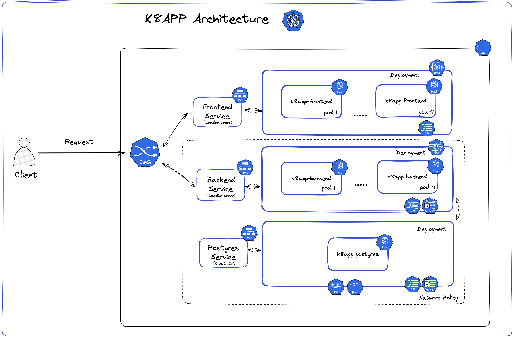

# Simple containerized application with Kubernetes.

This is a **TodoList application** which has **backend, frontend and database** deployed using Kubernetes.

**Running website in Google Cloud can be found here**:

* [Frontend](http://www.k8s.codes/)
* [Backend](http://k8s.codes/api)

## How to run:

### Docker Compose:

1) Go inside k8app folder
2) Run ```docker-compose up```
3) Navigate to **frontend** http://localhost:5000/
3) Navigate to **backend** http://localhost:8080/
4) Check out main page and visit http://localhost:8080/docs to play with API
5) If you wish you can connect to PostgresDB (find credentials in .env file) to investigate the items table and data
   stored on it.

## Kubernetes

### Architecture



This section provides information on the location and purpose of Kubernetes-related files.

### `k8-specs/` folder

The `k8-specs/` folder contains artifacts for creating Kubernetes objects using the command kubectl apply -f k8-specs.
It is important to note that Minikube in macOS does not currently support DNS resolution, so it is strongly recommended
to use Microk8s instead.

### `k8app-charts/` folder

The `k8app-charts/` folder contains artifacts to assist in the creation of Helm charts using the command helm install
k8app ./k8app-chart. These artifacts will help to streamline the deployment process for your Kubernetes application.

### `k8s-gcp/` folder

The `k8s-gcp/` folder contains artifacts for deployment using Google Cloud Platform. These artifacts will aid in the
deployment process on GCP and ensure proper configuration of your Kubernetes objects.

## Setup using Minikube

1) Enable minikube to see local Docker images: ```eval $(minikube -p minikube docker-env)```
2) Rebuild the docker images so now minikube sees them ```docker-compose build```
3) To enable the NGINX Ingress controller, run the following command: ```minikube addons enable ingress```.
3) Install metrics server for
   minikube ```kubectl apply -f https://github.com/kubernetes-sigs/metrics-server/releases/latest/download/components.yaml```
   so minikube can measure utilization of deployment (needed for HPA)
3) Navigate to ```k8s``` folder and run ```kubectl delete -f .;kubectl apply -f .```
4) Create a tunnel to load balancer with minikube: ```minikube service lb-backend``` or ```minikube tunnel lb-backend```
5) Follow generate tunnel URI with to see backend container

### How to make a rollout

- Make a change in your deployment file (Change the image tag or the limits)
- Create configmaps.
- Execute `kubectl apply -f [FILE_NAME]`
- Validate rollout satus with `kubectl rollout status deployment/[DEPLOYMEN_TNAME]`
- Get rollout history with `kubectl rollout history deployment/[DEPLOYMENT_NAME]`
- Go back to a specific revosion `kubectl rollout undo deployment/[DEPLOYMENT_NAME] --to-revision=1`

### How to make a canary deployment

- Execute `kubectl apply -f k8s-microk8s/frontend-deployment-canary-v1.yml`
- Execute `kubectl apply -f k8s-microk8s/frontend-deployment-canary-v2.yml`
- Scale down v1 `kubectl scale --replicas=9 k8app-frontend-v1`
- Delete deployment v1 `kubectl delete -f k8s-microk8s/frontend-deployment-canary-v1.yml`

#### Google Cloud

`k8s-gcp` contains YAML files for GCP.

To set up dependencies - consult
this [guide](https://cloud.google.com/kubernetes-engine/docs/how-to/cluster-access-for-kubectl)

```bash

# build FE with linux/amd64 architecture
docker buildx build frontend -f frontend/frontend.dockerfile -t kotonium/k8app-frontend-image:1.2 --platform=linux/amd64

gcloud auth login {username} 

gcloud auth list 

# Connect kubectl to google cloud
gcloud container clusters get-credentials autopilot-cluster-1 --region us-central1
```

## Tech stack

### Backend

Backend is built using Python and FastAPI framework.

### Frontend

Backend is built on React component and is run using npm.

### Database

Postgres is used as primary data store. Credentials can be found in .env file.

## Further details

See detailed docs on ```backend``` and ```frontend``` in corresponding folders.


